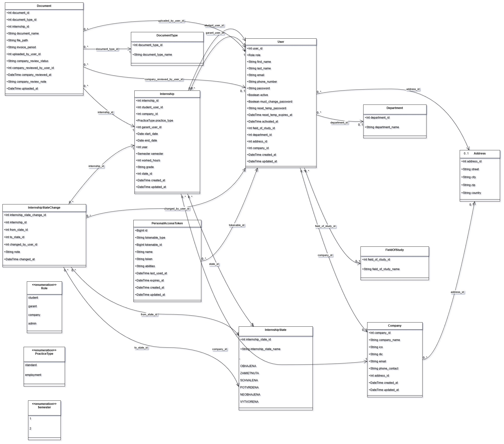
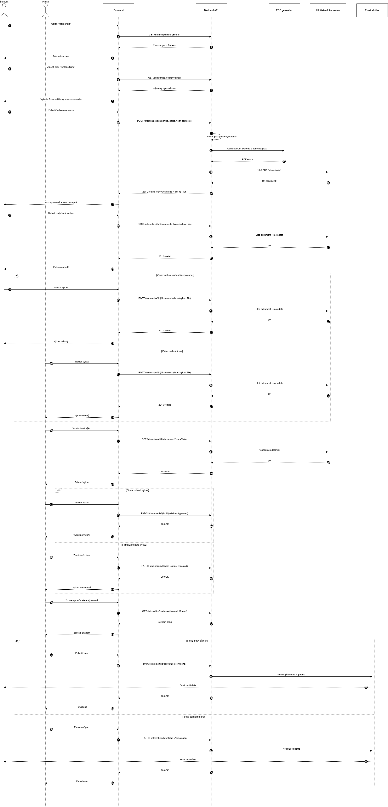
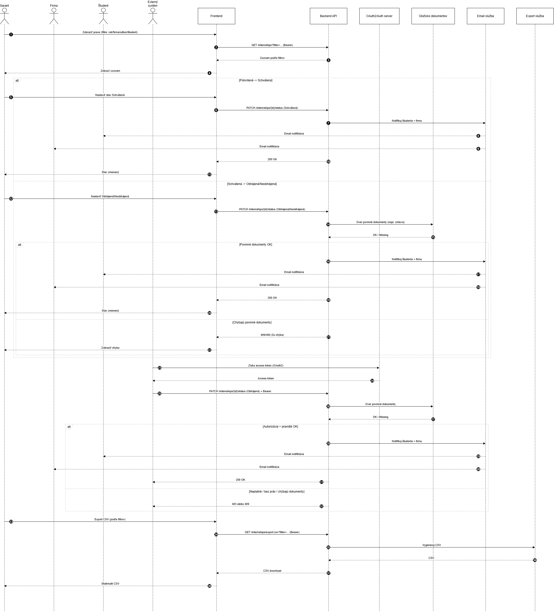
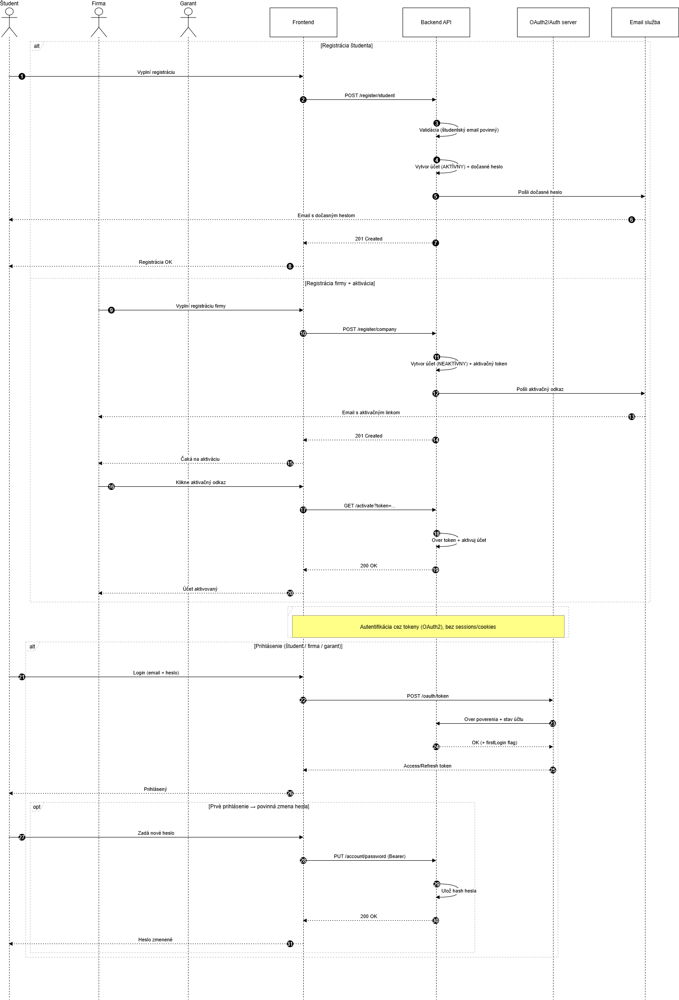
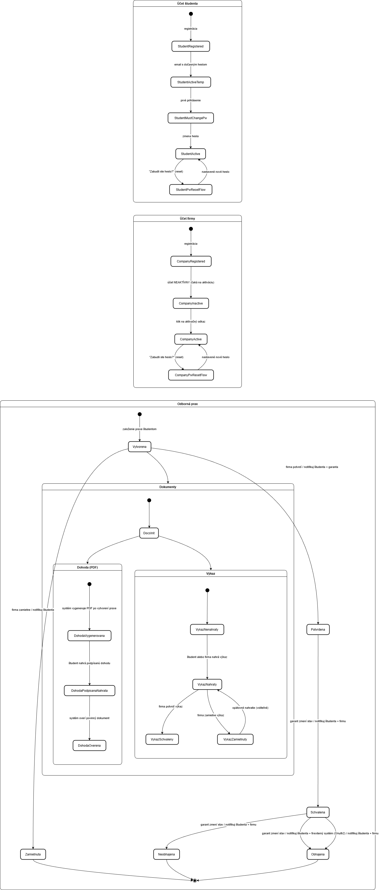
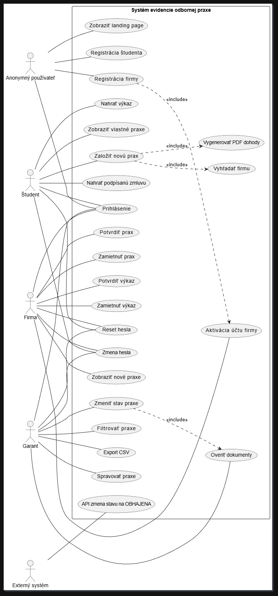

# Systém na evidenciu odbornej praxe

Webový systém na **evidenciu odbornej praxe** (študent – firma – garant – externý systém) so správou procesov, stavov praxe, dokumentov a exportov.

Projekt beží ako 2 samostatné aplikácie:
- **Backend (`backend/`)**: Laravel REST API – `http://localhost:8081`
- **Frontend (`frontend/`)**: React + Vite (SPA) – `http://localhost:5173`

PDF dokumenty (dohoda) sa generujú **z HTML šablóny (Blade)** pomocou **Dompdf**.

---

## Obsah
- [Prehľad](#prehľad)
- [Role a oprávnenia](#role-a-oprávnenia)
- [Funkcionalita](#funkcionalita)
  - [Registrácia a účty](#registrácia-a-účty)
  - [Praxe](#praxe)
  - [Dokumenty](#dokumenty)
  - [PDF dohoda](#pdf-dohoda)
  - [Integrácia externého systému](#integrácia-externého-systému-oauth-20--passport)
- [Architektúra](#architektúra)
- [Technológie](#technológie)
- [Požiadavky](#požiadavky)
- [API](#api)
- [Spustenie projektu lokálne](#spustenie-projektu-lokálne)
  - [1) Backend (Laravel)](#1-backend-laravel)
  - [2) Frontend (React/Vite)](#2-frontend-reactvite)
  - [Overenie, že projekt beží](#overenie-že-projekt-beží)
- [Konfigurácia (.env)](#konfigurácia-env)
  - [Frontend](#frontend)
  - [Backend](#backend)
  - [Bezpečnostná poznámka k .env](#bezpečnostná-poznámka-k-env)
- [Generovanie PDF (HTML → PDF)](#generovanie-pdf-html--pdf)
- [Riešenie problémov](#riešenie-problémov)
- [Bezpečnosť](#bezpečnosť)
- [Diagramy](#diagramy)

---

## Prehľad

Systém poskytuje:
- verejnú landing stránku,
- registráciu a správu účtov (študent, firma),
- evidenciu praxí (vytvorenie, schvaľovanie, zmena stavov),
- prácu s dokumentmi praxe (nahrávanie, sťahovanie, schválenie/zamietnutie výkazu firmou),
- notifikácie e-mailom,
- export dát do CSV (garant),
- integračné API pre externý systém (zmena stavu „Schválená → Obhájená“).

---

## Role a oprávnenia

- **Anonymný používateľ** – landing, registrácia, prihlásenie
- **Študent** – vytvára a spravuje vlastné praxe, nahráva dokumenty, sťahuje dohodu
- **Firma** – filtruje si študentov na danej praxi podľa potreby, potvrdzuje/zamieta prax, schvaľuje/zamieta výkaz
- **Garant** – správa všetkých praxí, zmeny stavov, export CSV, práca s dokumentmi
- **Externý systém** – autorizované API (**OAuth 2.0 / Passport**, `client_credentials`, scope `external-integration`)

---

## Funkcionalita

### Registrácia a účty
- registrácia študenta (typicky cez školský e-mail)
- registrácia firmy + aktivácia účtu (cez odkaz v e-maile)
- prihlásenie, odhlásenie
- zabudnuté heslo a reset (temp heslo / nútená zmena hesla)

### Praxe
- študent: zoznam praxí, detail, vytvorenie, úprava, zmazanie
- firma: zoznam praxí, potvrdenie / zamietnutie, zmena stavu, kontakt na garanta
- garant: zoznam všetkých praxí, detail, úpravy, schválenie / zamietnutie, zmena stavu, hodnotenie, export CSV

### Dokumenty
- upload a download dokumentov k praxi
- firma schvaľuje / zamieta výkaz študenta

### PDF dohoda
- generovanie dohody pre prax typu `standard` (HTML šablóna → PDF)

### Integrácia externého systému (OAuth 2.0 / Passport)

Integrácia externého systému je riešená cez **OAuth 2.0** pomocou **Laravel Passport** a grant typu **client_credentials**.

- **Token endpoint:** `POST /oauth/token`
  - `grant_type=client_credentials`
  - `client_id`, `client_secret`
  - `scope=external-integration`

- **API endpoint:** `POST /api/external/internships/{id}/defend`
  - **Header:** `Authorization: Bearer <access_token>`

#### Príklad – získať token (PowerShell)

```powershell
$body = @{
  grant_type = "client_credentials"
  client_id = "<CLIENT_ID>"
  client_secret = "<CLIENT_SECRET>"
  scope = "external-integration"
} | ConvertTo-Json

$token = (Invoke-RestMethod -Method Post -Uri "http://localhost:8081/oauth/token" -ContentType "application/json" -Body $body).access_token
```

#### Príklad – volanie endpointu (prax id 123)

```powershell
Invoke-RestMethod -Method Post -Uri "http://localhost:8081/api/external/internships/123/defend" -Headers @{ Authorization = "Bearer $token" }
```

---

## Architektúra

Projekt je rozdelený na:
- **Backend (`backend/`)**: Laravel REST API + generovanie PDF + správa dokumentov
- **Frontend (`frontend/`)**: React SPA (Vite), komunikuje s backend API

Komunikácia:
- Frontend volá backend cez `VITE_API_URL` (napr. `http://localhost:8081`).

---

## Technológie

- **Backend:** Laravel 12 (PHP 8.2+)
- **Frontend:** React + Vite (TypeScript)
- **Auth (interní používatelia):** Laravel Sanctum
- **Externá integrácia:** Laravel Passport (OAuth 2.0)
- **PDF:** Dompdf (HTML → PDF)
- **DB:** MySQL/MariaDB
- **Mail:** SMTP (produkčné nastavenie) / odporúčané `log` v lokále

---

## Požiadavky

Nainštalované:
- **PHP 8.2+**
- **Composer**
- **Node.js 18+** a **npm**
- **MySQL/MariaDB**
- odporúčané PHP extensions (Laravel): `pdo_mysql`, `openssl`, `mbstring`, `tokenizer`, `xml`, `ctype`, `json`, `curl`

Porty (lokálne):
- Backend: `8081`
- Frontend: `5173`
- DB: `3306`

---

## API

### Základná URL
- Backend: `http://localhost:8081`
- API prefix: `/api` (príklad: `http://localhost:8081/api/health`)
- OAuth token endpoint: `/oauth/token`

### Autentifikácia
- Verejné endpointy:
  - `POST /api/register/student`
  - `POST /api/register/company`
  - `POST /api/login`
  - `POST /api/password/forgot`
  - `POST /api/password/reset-with-temp`
  - `GET /api/health`
- Chránené endpointy používajú `Authorization: Bearer <token>` z `POST /api/login` (Sanctum).
- Role/middleware: `role:student`, `role:company`, `role:garant`, `scopes:external-integration`.

### Spoločné (vyžaduje prihlásenie)
- `GET /api/user`
- `GET /api/password/force-change-check`
- `POST /api/password/force-change`
- `GET /api/documents/{document}/download`
- `GET /api/internships/{internship}/agreement` (PDF dohoda)

### Študent
- `GET /api/companies`
- `GET /api/companies/search?q=`
- `GET /api/student/internships`
- `POST /api/student/internships`
- `GET /api/student/internships/{internship}`
- `PATCH /api/student/internships/{internship}`
- `DELETE /api/student/internships/{internship}`
- `GET /api/student/internships/{internship}/documents`
- `POST /api/student/internships/{internship}/documents` (multipart/form-data)
- `DELETE /api/student/documents/{document}`

### Garant
- `GET /api/garant/students/search?q=`
- `GET /api/garant/companies/search?q=`
- `GET /api/garant/internships`
- `GET /api/garant/internships/{internship}`
- `PATCH /api/garant/internships/{internship}`
- `POST /api/garant/internships/{internship}/approve`
- `POST /api/garant/internships/{internship}/reject`
- `POST /api/garant/internships/{internship}/grade`
- `PATCH /api/garant/internships/{internship}/state`
- `DELETE /api/garant/internships/{internship}`
- `GET /api/garant/internships/export`
- `GET /api/garant/internships/{internship}/documents`
- `DELETE /api/garant/documents/{document}`

### Firma
- `GET /api/company/internships`
- `GET /api/company/internships/{internship}`
- `POST /api/company/internships/{internship}/approve`
- `POST /api/company/internships/{internship}/reject`
- `POST /api/company/internships/{internship}/grade`
- `PATCH /api/company/internships/{internship}/state`
- `DELETE /api/company/internships/{internship}`
- `POST /api/company/internships/{internship}/contact-garant`
- `GET /api/company/internships/{internship}/documents`
- `POST /api/company/internships/{internship}/documents` (multipart/form-data)
- `POST /api/company/documents/{document}/report-approve`
- `POST /api/company/documents/{document}/report-reject`

### Externá integrácia (OAuth 2.0 / Passport)
- `POST /oauth/token` (grant_type=client_credentials, scope=external-integration)
- `POST /api/external/internships/{internship}/defend` (Bearer token so scope)

---

## Spustenie projektu lokálne

### 1) Backend (Laravel)

Prejdeme do priečinka backend:
```bash
cd backend
```

Nainštalujeme PHP závislosti:
```bash
composer install
```

Vytvoríme `.env`:
```bash
cp .env.example .env
```

Vygenerujeme app key:
```bash
php artisan key:generate
```

Vytvoríme databázu (MySQL) a nastavíme DB v `.env` (príklad):
```env
DB_CONNECTION=mysql
DB_HOST=127.0.0.1
DB_PORT=3306
DB_DATABASE=projekt_odbornaprax
DB_USERNAME=root
DB_PASSWORD=
```

Spustíme migrácie:
```bash
php artisan migrate:fresh --seed
```

> Poznámka: V projekte máme `SESSION_DRIVER=database`, `QUEUE_CONNECTION=database` a `CACHE_STORE=database`.
> Ak by sme narazili na chýbajúce tabuľky pre queue/cache, uistíme sa, že v projekte existujú príslušné migrácie (alebo ich vygenerujeme cez `php artisan queue:table`, `php artisan cache:table`) a spustíme `php artisan migrate:fresh --seed`.

Inicializujeme Passport (kvôli externému systému):
```bash
php artisan passport:install
```

```bash
php artisan passport:keys --force
```

Vytvoríme OAuth klienta pre `client_credentials` (ak ešte neexistuje):
```bash
php artisan passport:client --client
```
Uložíme si **CLIENT_ID** a **CLIENT_SECRET** – používa ich externý systém pri získaní tokenu.

Spustíme backend na porte 8081:
```bash
php -S 127.0.0.1:8081 -t public
```

(Voliteľné) Ak používame queue, spustíme worker:
```bash
php artisan queue:work
```

Logy backendu:
- `backend/storage/logs/laravel.log`

---

### 2) Frontend (React/Vite)

Prejdeme do priečinka frontend:
```bash
cd frontend
```

Nainštalujeme závislosti:
```bash
npm install
```

Spustíme dev server:
```bash
npm run dev
```

Frontend beží na:
- `http://localhost:5173`

---

### Overenie, že projekt beží

- Frontend: otvoríme `http://localhost:5173` a skúsime registráciu/prihlásenie.
- Backend: otestujeme API endpointy cez Postman/Thunder Client (alebo podľa UI).

---

## Konfigurácia (.env)

### Frontend

V `frontend/.env`:

```env
VITE_API_URL=http://localhost:8081
VITE_PUBLIC_URL=http://localhost:5173
```

### Backend

V `backend/.env`:

```env
APP_ENV=local
APP_DEBUG=true
APP_URL=http://localhost

DB_CONNECTION=mysql
DB_HOST=127.0.0.1
DB_PORT=3306
DB_DATABASE=projekt_odbornaprax
DB_USERNAME=root
DB_PASSWORD=

SESSION_DRIVER=database
QUEUE_CONNECTION=database
CACHE_STORE=database

FRONTEND_URL="http://localhost:5173"
SESSION_DOMAIN=localhost
SANCTUM_STATEFUL_DOMAINS=localhost,localhost:5173,127.0.0.1,127.0.0.1:5173

EXTERNAL_SYSTEM_USER_ID=200
```

### Bezpečnostná poznámka k .env

`.env` je len lokálne a do repozitára ho nedávame.

---

## Generovanie PDF (HTML → PDF)

PDF dohoda sa generuje z HTML (Blade) pomocou Dompdf:

- Šablóna dohody:
  - `backend/resources/views/agreements/standard.blade.php`

- Konfigurácia dohody:
  - `backend/config/agreement.php`

- Generovanie:
  - `backend/app/Services/AgreementService.php` (renderuje Blade → HTML → Dompdf → PDF)

- API endpoint na stiahnutie dohody:
  - `GET /api/internships/{internship}/agreement`
  - dostupné pre prihláseného používateľa (Sanctum)

- Výstup sa ukladá do:
  - `backend/storage/app/agreements/agreement_{internshipId}.pdf`

> Dohoda sa generuje iba pre prax s `practice_type = standard`.

---

## Riešenie problémov

**Frontend nekomunikuje s backendom (CORS / 401 / 419):**
- skontrolujeme `frontend/.env` → `VITE_API_URL=http://localhost:8081`
- skontrolujeme `backend/.env` → `FRONTEND_URL`, `SANCTUM_STATEFUL_DOMAINS`, `SESSION_DOMAIN`
- po zmene `.env` reštartujeme backend aj frontend

**DB chyby / migrácie:**
- skontrolujeme, či beží MySQL a existuje DB `projekt_odbornaprax`
- skontrolujeme `DB_*` v `backend/.env`
- spustíme `php artisan migrate:fresh --seed`

**Nechodia e-maily (lokálne):**
- nastavíme `MAIL_MAILER=log` a sledujeme `backend/storage/logs/laravel.log`

**Externý systém nevie získať token:**
- uistíme sa, že Passport je nainštalovaný (`php artisan passport:install`)
- uistíme sa, že existuje client credentials klient (`php artisan passport:client --client`)
- scope musí byť `external-integration`

**PDF sa nevytvorí:**
- skontrolujeme šablónu `backend/resources/views/agreements/standard.blade.php`
- skontrolujeme zapisovanie do `backend/storage/app/agreements/`
- skontrolujeme, že prax má `practice_type=standard`

---

## Bezpečnosť

- interní používatelia používajú **Sanctum** (Bearer tokeny) + kontrola rolí cez middleware (`role:student`, `role:company`, `role:garant`, `role:external`)
- externý systém používa **OAuth 2.0 / Passport** (`client_credentials`, scope `external-integration`)

---

## Diagramy






